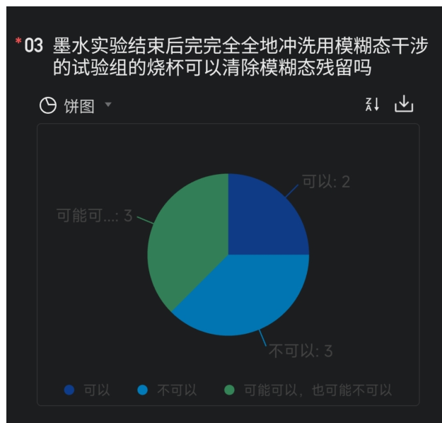
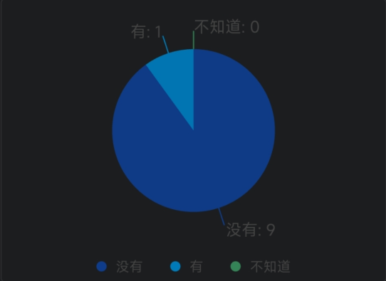
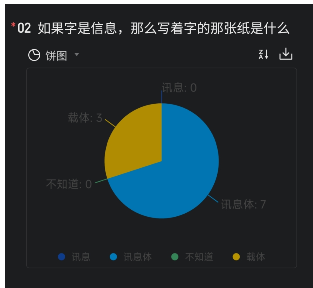
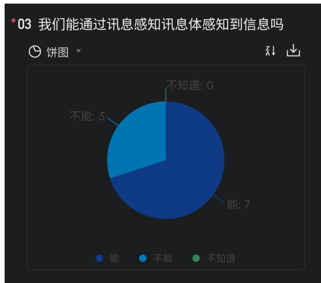
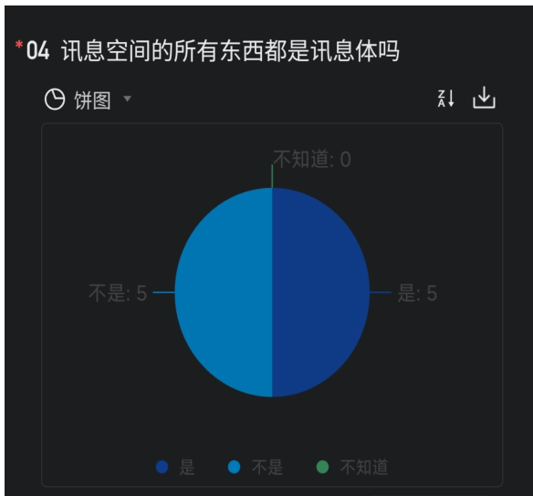
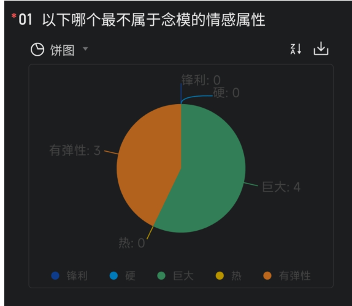

# 第十二届异能原理学

完全内容（以 5 天划分）

by 凪屿朔·奏·夏因（さく）/qq 号 3636979238/

- 排版借助 k2.6 机械降神半手搓 -

阅前提醒：本文有些地方是由聊天记录复制粘贴整理而成的，在遣词造句上未经过精修，全文会有较多处不严谨的地方，作者是低精力人群，只是排版就力竭了（且目前在排版上还有点问题，发现自己实在懒得改了，感觉看的人也不会在意，如果有人提出会进行修改），内容就等以后再精修（未来也许，or 有人提意见）。

~~契机：因某些小事充了 WPS 会员，寻思不能浪费钱，所以完成子本文件~~

qq 交流群 275723605

“那些庸俗的，奇幻的，保守的，激进的，在地的，跨国的…”

## 第一天

## 一、异能概述

### 1.1 按流派/体系划分

先按异能圈流派/体系层面来划分异能，在此列举几个和原理学相关的：

#### 超心理学

- 研究每个人天生具有的超级微弱异能
- 核心理论：甘兹菲尔德实验（The Ganzfeld Experiment）和统计学
- 采用统计学对一系列超级微弱异能进行验证
- 例如甘兹菲尔德实验探索个体是否能够通过非传统的感官途径接收和理解信息（通过强迫选择方法达成，接收者只能从四个图片里选择一个认为相似的）
- 部分实验证明该操作能够让 25% 的期望提高接近 10% 的正确率
- 论文主要连载于《Journal of Parapsychology》

在超心理学领域，ESP 和 PK 是两大核心研究主题：

- ESP（Extra-Sensory Perception）：非常规感知
- PK（Psychokinesis）：干涉物质（也可以说是念力）
- ESP 例如：遥视/千里眼、预知、心灵感应

**与原理学的关系：**原理学的 PK 都是经过各种实验体系放大影响后的 PK；ESP 的话几乎是围绕心灵感应构建的 ESP。原理学都会用到 ESP 和 PK 的技法，实验都差不多。

#### 异能原理学

- 研究每个人轻微程度训练具有的微弱异能

- 核心理论：普适异能、精神状态和讯息感知
- 以普适异能的规律指导非普适异能的使用
- 普适异能：任何人可以通过较低程度的训练产生的能够通过对应检验实验的异能（如模糊态）
- 原理学参考了群文件的《超心灵应用学》，无论是实验还是一些理论

#### 人体科学

- 研究高度训练高度开发后的强大异能
- 核心理论：功能态和屏幕效应
- 研究了一系列非常强大的异能现象，但只有少数人能够经过高度训练产生
- 论文主要连载于维普网正方数据库《中国人体科学》
- （模糊态 2.0 比较和人体科学接轨，2.0 是什么以后再讲）

*注：各种异能体系如精神力类的、各种自创修炼法都是门槛相对异能原理学比较高的，相关性都沾点，毕竟都属于异能，本质上都涉及到能量。*

### 1.2 异能使用的基本规律

- 使用异能一般都会有残留，大部分在灵体层显现，少部分在物质层显现
- 根据残留会感知的可以通过感知进行溯源
- 有的异能表现形式可能和内心所想不同，大多数是遵从内心想法的
- 异能可分为可控和不可控，都是正常的
- 如果自己与他人的异能效果表现形式不同也是正常的（属于少见情况，一般说明天赋较好）

---

## 二、能量

能量的“质”和“量”是衡量异能效果的重要维度：

| 维度 | 含义 |
| --- | --- |
| 质 | 能量的特性和属性 |
| 量 | 能量的强度和持续时间 |

通过对能量层次和量级的深入研究，修炼者可以更好地掌握和提升自己的异能水平。

**重要提示：**一般来说，能量更强，对物质层的干涉力越强。这里的“强”既指能量的性质，也指强度。

能量其实有很多名字（如气、精神力、灵气等），导致这些名字的划分只是因为性质、来源或强度不同而已，其实都可以统称为能量。他们都属于能影响心灵、现实的力量。

Q&A

**问：所以这些异能会有什么等级划分吗？自身修炼也会有什么等级吗？**

**答：**异能一般没有等级划分，有等级划分那属于很高层次的了。明确修炼的等级划分就要看体系了，比如各种异能圈修炼法、精神力修炼法，或者各种玄学体系。实际上圈子也几乎没人划分异能等级，这个不用考虑。

## 三、网站推荐

第一天无原理学实践内容。

提供两个异能测试网站作为个人实践参考（可能需挂 VPN）：

- [psiarcade.org](https://psiarcade.org/)
- [zener.cards](https://zener.cards/)

## 四、第一天作业解析

 统计：一共 13 人写了作业，全对的只有 3 个人。

**第一题**

**题目：**

#### \*01 《超心灵应用学》一书属于超心理学吗？

|  |  |
| --- | --- |
| 完全属于 | 4 份(30.76%) |
| 完全不属于 | 1 份(7.69%) |
| 不知道 | 2 份(15.38%) |
| 不完全属于 | 6 份(46.15%) |

答案：**不完全属于**

解析：

总结一下，首先，肯定存在一种神秘的力量在心灵和物理世界之间连系。其次，这种力量仍然潜伏，有一些手法可能能够利用这种力量，但是仅仅利用了它的 4%（假设完全使用这种力量可以使感知达到 100%），这就造成了明明证明了其存在，而无法利用的现状。

还有另一种更好的解释，把心灵感应也看做人体的一种器官，ESP 要求用心灵感应去分辨扑克花色，不就相当于用听力去分辨白纸上的字吗？耳朵所听到的东西确实不是眼睛能看到的实体，但是却真真切切的存在。ESP 也是一样，用心灵感应去感知眼睛看到的物体，就像用耳朵去听不发出声响的东西，我们不能因为听不到，就说它是不存在的。

超心灵应用学，就是为了寻找，还有其他的方法，能够利用这种神秘的力量，而且远超 ESP 中 4% 的利用率。虽然仍存在大量的难以逾越的屏障挡在心灵与外界现实之间，但至少，有一部分，已经破开了。

超心灵应用学，这套体系于 2009 年被张晴蓝整合，在 2013 年正式提出，之后进行了漫长的实验。最开始的时候，我们只是想看看人与人之间的心灵感应是不是真的可以做到，就像星门计划里的异能探员，或者像动漫电影里那样激活魔法能量。看上去肯定是不可能的，随着一次次的尝试，虽然没有获得魔

6

超心灵应用学

法，没能发射小火球。但是我们发现了一个从来没有想象过的“世界”。

这个体系很大很大，我不知道从哪里开始向你诉说，如果你直接往下翻，或许你根本听不懂我在说什么，许多的名词，就像发现新大陆一样，谁最先发现谁就有命名权，于是我们所发现的这一切，都由我们自己来进行命名。辛苦各位读者了，我们的命名也尽可能都是字面意思。

**由图可知作者打算另辟蹊径建立一套应用体系。超心灵应用学在超心理学的基础上形**

成，是应用程度更好的体系。它自创了一套庞大的术语（如讯息体、灵核、实化度等），由这些术语来说也不属于主流的超心理学。

但是超心灵应用学这本书中探讨的（如 ESP、意识干涉随机数等）本质上还是属于超心理学的研究课题。引用源头（全球超心理学研究背景（全球知觉项目（GCP）等）也是经典超心理学研究背景。所以说根基/本质是属于超心理学的。

因此，在四个选项中只有“不完全属于”最符合。

#### 第二题

\*02 在评判能量强不强的时候，我们可能会考虑到其“质”和“量”，那么依据二者来评判强度时，一般哪个方面的重要性更大？

|  |  |
| --- | --- |
| 质 | 5 份(38.46%) |
| 量 | 4 份(30.76%) |
| 我不知道 | 0 份(0%) |
| 一样大 | 4 份(30.76%) |
| 不用考虑 | 0 份(0%) |

答案：质

（解析略）

#### 第三题

\*03 普适异能可以通过物理实验进行检验吗？

|  |  |
| --- | --- |
| 都可以 | 4 份(30.76%) |
| 都不可以 | 0 份(0%) |
| 我不知道 | 1 份(7.69%) |
| 有些可以，有些不可以 | 8 份(61.53%) |

**答案：**有些可以，有些不可以

**解析：**讲课内容提到“能够通过对应检验实验的异能”并没有说全是物理实验。比如，原理学中，模糊态是物质层的实验，而讯息感知是心灵层的实验。

## 第二天

## 一、模糊态

### 1.1 概念定义

模糊态可以说是原理学的一项技能名称，它是一种：

- 注重空间范围
- 关注该范围内的每一个点

的想象。

也就是说，模糊态是一种**想象方式**，而不是一种状态或者形态。模糊态和它的名字并没有什么关系。

"注重空间范围"是指这个想象的物体拥有在我们的空间中对应的位置。比如想象在某个地方有一个什么东西就是一个注重空间范围的想象；而如单纯想象动画发展剧情，该想象和空间没有关系就不是。

"关注该范围内的每一个点"是指关注该范围的每一个部分，直到细分下去不可分割的部分。这是一种形象的描述而不是实际的要求——你不太需要真的做到细分到不可再分，一般也比较困难，而在实际实验的运用中也没必要。理论上你关注得越整体，模糊态效果越好；细分得越细，效果越好。一般想象到分子化就没什么问题了。

### 1.2 操作方法

模糊态的操作方法简单来说是：**想象一个物质中的每个细小的点都融为一体成为一体。**

- 理论上这些点细分得越细越好
- 侧重点是融为一体，所以细分程度的权重可以放低些，重点在融为一体
- 细分的程度大小所对原理学实验效果没什么大影响

模糊态的应用方式还可以表述为：想象意念拥有实体，填充了一定的空间范围，使空间范围内所有东西融为一体。所以重点也在于**意念的集中**。

### 1.3 干涉特性

模糊态对物质的干涉是多种多样的，但是在特定的一类物理现象只能有一种干涉效果。例如干涉墨水扩散现象只有一种干涉效果。这说明模糊态的作用效果一定会受到被干涉对象的影响。

*需要额外强调的是，即使是同一类物理现象，也可能因为干涉范围等干涉方式的不同产生不同的异能效果。*

模糊态这种特殊的想象形式具有极其特殊的作用，可以产生一些异能的效果，但一般来讲需要特定的检验方式才能察觉到它的作用。

### 1.4 干涉效果

模糊态对物质的影响比较微弱。原理学中发现的模糊态干涉效果包括但是不限于：

- 墨水直线下降
- 出现竖线
- 虫子假死
- 磁体消磁
- 火焰拉长
- 喝干涉过的水可能肚子疼等

### 1.5 基本性质

| 性质 | 说明 |
| --- | --- |
| 普遍性 | 模糊态是一种很普遍的异能，只要是个人就能会 |
| 起源 | 模糊态是原理学发现的第一个普适异能，可以说整个异能原理学都是从模糊态开始的 |
| 独特性 | 模糊态的有些干涉效果具有独特性，无法被已知物理手段复制 |
| 扩散速度 | 影响可以以 0.4 m/s（待定，目前来看大概率假）的速度扩散出去，这个数值很具有偶然性 |
| 作用本质 | 效果几乎就是加强分子作用力，有的表现为粘性增加 |

|  |  |
| --- | --- |
| 附着传播 | 模糊态干涉后的物体也会具有模糊态影响的扩散能力。模糊态会附着在物质上，并随着物质传播出去，类似于放射源 |
| 清除方式 | 实验中利用大量水冲洗从而清除模糊态影响正是基于此原理。比如你对该瓶子的水进行模糊态的干涉，旁边的瓶子的水也会被传染 |

## 二、实验：墨水扩散实验

### 2.1 实验条件

- 室温：比较重要，25 摄氏度比较好，一般水是常温就够了
- 墨水实验如果温度越高干涉越困难
- 温度低到一定程度（接近结冰），很难看出干涉和没干涉的效果区别

### 2.2 实验用具

| 用具 | 说明 / 替代方案 |
| --- | --- |
| 烧杯 | 可用透明塑料杯代替，尽量高度不要太低 |
| 胶头滴管 | 可用空笔芯和单个筷子代替，或别的其他东西 |
| 墨水 | 一定要用非油性墨水，可以用墨汁 |
| 尺子 | 放在杯子旁边，保证每次滴墨胶头滴管和水面的距离相同 |

替代用具的要求：只要能滴墨，只要能保证两次滴墨墨量差不多一样，以及保证滴墨初速度一样（差不多）就行。

### 2.3 实验步骤

1. 把两个烧杯分开放置，相隔一米以上  
2. 在第一个烧杯中正常滴墨（记得必须是前置对照，因为空间积累会有残留影响），不要干涉，录像记录现象  
3. 在另一个烧杯装水  
4. 冥想（可选，一般一分钟够了）。（先冥想的效果一般会相对不冥想好，也看个人。重点在意念专注。）

5. 使用模糊态干涉水一分钟以上。一定不能干涉墨水，会导致不同效果  
6. 滴一滴墨即可  
7. 最后保存录像，观察现象，对比干涉的和不干涉的前后现象

干涉过的记得每次结束洗一下杯子内外壁，可能有概率清除模糊态残留。

---

## 三、第二天作业解析

 统计：一共八个人写，共五题。没有一个人是全对的。

#### 第一题

\*01 在异能原理学目前的模糊态运用相关实验中，是否有运用到类似“想象心灵空间中有一个花瓶”的想象技法

☐ 表格 ▾ ↕ ↓

|  |  |
| --- | --- |
| 是 | 4份(50%) |
| 否 | 4份(50%) |

答案：**否**

解析及点评：**不是心灵空间，可以说是物理空间/物质层。居然有这么多人选“是”。**

#### 第二题

\*02 在以下选项列举的人中，哪个人最有可能难以使用模糊态

- 16岁，高中生，体质虚弱，不爱运动，时不时有躯体化症状，经常抑郁，甚至有od出幻觉的经历
- 7岁，小学二年级学生，性格活泼好动，非常调皮，不认真学习，成绩不好，很热爱科学
- 19岁，大学生，数学成绩不好，经常无法认真听课，喜欢神游天外。
- 24岁，前端工程师，情商较低，得了某个罕见病，想象力非常差，建模时脑子没有画面

\*02 在以下选项列举的人中，哪个人最有可能难以使用模糊态

饼图

| 选项 | 人数 |
| --- | --- |
| 16岁，高中生，体质虚弱，不爱运动，时不时有躯体化症状，经常抑郁，甚至有od出幻觉的经历 | 1 |
| 7岁，小学二年级学生，性格活泼好动，非常调皮，不认真学习，成绩不好，很热爱科学 | 2 |
| 19岁，大学生，数学成绩不好，经常无法认真听课，喜欢神游天外。 | 0 |
| 24岁，前端工程师，情商较低，得了某个罕见病，想象力非常差，建模时脑子没有画面 | 5 |

答案：D

解析及点评：有五个人对了。想象力过低、想象时没有画面，一般模糊态使用起来是非常

困难的。

#### 第三题

\*03 墨水实验结束后完完全全地冲洗用模糊态干涉的试验组的烧杯可以清除模糊态残留吗

饼图

| 选项 | 数量 |
| --- | --- |
| 可以 | 2 |
| 不可以 | 3 |
| 可能可以, 也可能不可以 | 3 |

答案：可能可以，也可能不可以

解析及点评：这个有讲过，不一定能清除残留，但是以防万一推荐这么干。

#### 第四题

\*04 墨水实验中，模糊态是对什么进行干涉

表格

| 选项 | 数量 |
| --- | --- |
| 水 | 6 份(75%) |
| 墨水 | 1 份(12.5%) |
| 烧杯 | 0 份(0%) |
| 空气 | 0 份(0%) |
| 烧杯+水+墨水 | 1 份(12.5%) |
| 水+墨水 | 0 份(0%) |
| 其他 | 0 份(0%) |

答案：**水**

解析及点评：**这个是正确率最高的一集。居然有人选烧杯加水加墨水，这个人还是经历过几届的积极老资历。**

#### 第五题

\*05 [多选] 以下描述正确的是？

- 模糊态的干涉效果具有独特性，无法被已知物理手段复制。
- 模糊态是一种想象方式，它关注的空间范围可以是全球。
- 喝下模糊态干涉过后的水会肚子疼和对两个磁体进行模糊态干涉后磁体同极的排斥力减弱，这两个现象都一定是模糊态导致的
- 40摄氏度的水适合进行墨水实验
- 模糊态的传染速度有标准的数值
- 在模糊态对物质的影响效果中，存在对光线大小的影响
- 模糊态的效果可以表现为加强分子作用力

|  |  |
| --- | --- |
| 模糊态的干涉效果具有独特性，无法被已知物理手段复制。 | 5 份(20%) |
| 模糊态是一种想象方式，它关注的空间范围可以是全球。 | 8 份(32%) |
| 喝下模糊态干涉过后的水会肚子疼和对两个磁体进行模糊态干涉后磁体同极的排斥力减弱，这两个现象都一定是模糊态导致的 | 0 份(0%) |
| 40摄氏度的水适合进行墨水实验 | 1 份(4%) |
| 模糊态的传染速度有标准的数值 | 0 份(0%) |
| 在模糊态对物质的影响效果中，存在对光线大小的影响 | 3 份(12%) |
| 模糊态的效果可以表现为加强分子作用力 | 8 份(32%) |

正确答案：**B、F、G**

解析：

- **A 选项：少了"有些"，说得太绝对了，原句在讲课内容出现过**

- F 选项：正确，干涉火焰导致的火焰能级变化

## 第三天

## 一、信息

### 1.1 基本概念

信息是什么，这个比较常识了，很好理解。

- 具体的信息例如：纸上的内容、手机的位置、皮肤的颜色
- 信息的表现形式多不胜数：声音、图片、温度、体积、颜色等

### 1.2 讯息体

讯息体是由信息转化出来的具有形态的想象，也可以说讯息体是特定过程产生的能量。这些在物理世界没有实体的、可以被大脑理解的信息，经过一些特殊的想象过程，在讯息空间里就表现出了“实体”。

类比理解：

- 讯息体是信息的载体
- 比如故事类似于信息，书类似于讯息体
- 讯息体的特点是：把一个故事变成了一本书，我们可以通过故事的一些特征找到这本书，我们可以讨论书的材质、标题、厚度，却无法翻开这本书读取实际的内容

*讯息体可以说就是对信息的包装。信息不是实体，但在心灵层面中，是具有形态的实体。讯息空间是由讯息体组成的空间。讯息是一个东西附带的信息。*

### 1.3 讯息空间

讯息空间是由讯息体构成的空间，也是以特定的一种感受去感受所有事物形成的空间。在这一空间内能够更容易的通过特征定位讯息体。

进入讯息空间的方法：

1. 1.通过冥想等方式减少信息的输入  
2. 2.通过暗示潜意识等方式将接受到的信息全部以讯息体的形式表现

**3.扩展感知的边界接触更多的讯息体**

前述方法具有难度，但也有更容易做到的近似方法：注意力从头部出发（也可以是其他部位），先突破身体表层，将自己与周围融合，把感知延伸到外部世界，持续扩大融合的范围。

### 1.4 讯息感知 vs 资讯感知

讯息体可以比作一个密封的漂流瓶。

讯息感知是感知到：

- 瓶子的颜色、温度、重量
- 瓶身粗糙度
- 摇晃时里面沙沙的质感
- 它带给你的压迫感或亲切感

讯息感知不能感知到它里面的信息。如果要感知到它里面的信息也是可以的，但是那已经是属于资讯感知。

按照定义划分，只要你的感知对象是讯息体，这个行为本身就叫做讯息感知。如果不强调是资讯感知的话，默认感知是讯息感知。

| 类型 | 说明 |
| --- | --- |
| 讯息感知 | 感知讯息体的外在特征，无法知道讯息体是怎么做出来的（即不知道制作的人对它注入了什么信息） |
| 资讯感知 | 从讯息体中感知信息，准确率一般较低，保持高准确一般会比较困难 |
| 重要说明 | 只有讯息感知是这样的，其他的感知可以逆。讯息感知只是感知里容易练的一种 |

如果你一定想从讯息体感知信息，那就不是纯讯息感知了，混进了资讯感知。过程可能是讯息感知，但是结果变成了资讯感知的结果。

---

## 二、实验

#### 1-1: 訊息体攻击实验

#### 步骤:

决定谁是发送方, 谁是接收方。

接收方可以选择画图也可以不画, 刚开始建议不画。

如果不画图: 发送方直接想象对方头像做外壳, 然后把对方特质(如名字)加进这个外壳里去。

如果画图: 接收方随手画一个图就行, 然后把关于自己的信息(如名字、头像等)注入那张图里, 并把自己与那张图链接。

开始的时间发送方自己定, 开始的时候在群里发送"开始", 并开始攻击对方的訊息体(如碰撞等交互)。

发送方自由决定停止时间(攻击时间不要太长也不要太短, 一般一两分钟)。

停止时发送方要截图时间戳网站页面, 接收方感觉发送方停止了也截图时间戳网站页面。

最后在群里一起发时间戳的图, 图误差在 5s 内属于心灵感应比较好。

*接收方画图 → 接收方创造訊息体, 图相当于訊息体外壳, 发送方只需对着图连接不用自己创造*

*不画图 → 发送方就要自己创造*

#### Ostop

Ostop 的步骤和 1-1 差不多, 只是把攻击改为了传 0, 传数字 0, 也就是对着对方訊息体传 0。

---

## 三、Q&A

**问:** 不是很明白"无法翻开这本书读取实际的内容"的意思。

**答:** 在某种意义上能感知訊息体只是无法知道訊息体是怎么做出来的。比如我们能通

过一个图形注入自己的特征让它成为关于自己的讯息体，那么这个讯息体就代表了自己。这里的“代表自己”指讯息体外在的信息，而不是内在的（即生成讯息体的信息）。因为你对这个讯息体下了定义或者说翻译，所以它有这个意思。

**问：感知的顺序是不可以逆向的吗？所以可以感知讯息体，但无法感知它蕴含的其他讯息，这样吗？**

**答：**对讯息体的感知不能逆（这叫讯息感知），其他的感知可以。讯息感知是感知讯息体的，只是无法知道讯息体是怎么做出来的，也就是不知道制作的人对它注入了什么信息。只有讯息感知是这样的，其他的感知可以逆。讯息感知只是感知里容易练的一种。

## 四、第三天作业解析

 统计：目前有十个人写了，只有两个人全对。

#### 第一题

\*01 讯息体在物质世界中有形态吗

饼图

| 选项 | 数量 |
| --- | --- |
| 没有 | 9 |
| 有 | 1 |
| 不知道 | 0 |

**答案：没有**

**解析及点评：**居然有一个人填“有”。答案显而易见是没有。

#### 第二题

\*02 如果字是信息，那么写着字的那张纸是什么

饼图

| 选项 | 数量 |
| --- | --- |
| 讯息 | 0 |
| 讯息体 | 7 |
| 不知道 | 0 |
| 载体 | 3 |

图例：讯息 (深蓝色)、讯息体 (亮蓝色)、不知道 (绿色)、载体 (黄色)

答案：**讯息体**

解析及点评：**居然有三人选“载体”，载体这个词都没怎么出现过吧，我以为会有 0 个人选这个。简单的就不解析了。**

#### 第三题

\*03 我们能通过讯息感知讯息体感知到信息吗

饼图

| 选项 | 数量 |
| --- | --- |
| 能 | 7 |
| 不能 | 3 |
| 不知道 | 0 |

图例：能 (深蓝色)、不能 (亮蓝色)、不知道 (绿色)

答案：**不能**

**解析：**这里明确是讯息感知，如果要感知到信息在概念划分上属于是资讯感知。

#### 第四题

\*04 讯息空间的所有东西都是讯息体吗

饼图

| 选项 | 数量 |
| --- | --- |
| 是 | 5 |
| 不是 | 5 |
| 不知道 | 0 |

**答案：**是

**解析及点评：**这个挺基础的。准确率惊为天人。

---

## 第四天

## 一、概率干涉的衰减效应

超心理学实验中有一个非常经典的现象，它是概率干涉的衰减效应。在概率干涉（如影响随机数发生器）实验中，受试者在实验刚开始时表现很好，但随着时间的持续，其表现会不可逆转地滑落，直至完全失效，甚至比随机概率（纯正常运气）还要低。

### 1.1 推测原因

常见的有三种推测的原因：

1. 1.受试者疲劳：长时间的精神高度集中导致生理机能消耗。  
2. 2.注意力下降：初期的新鲜感过后，难以维持对随机过程的专注凝视。  
3. 3.动机减少：实验重复枯燥，受试者失去了一开始证明自己的强烈渴望。

### 1.2 Rhine 的观点

J.B. Rhine（现代超心理学之父）等研究者认为，这种“先高后低”的曲线是特异功能存在的隐蔽证据。因为如果完全是随机猜测，曲线应该一直平直，而不会出现“初期显著偏离”这个峰值。这说明初期的确有一股非物理的力量介入，只是它很快被某种机制耗尽了。

---

## 二、念模

### 2.1 构建方法

首先想象一个立方体或者是任何图形，2D 也可以 3D 也可以，尽量设定好它的颜色、大小、形状，然后持续专注注入能量让它稳定。接下来给它加上情感属性，如它很坚硬、锋利、烫等，持续这种感知一段时间，实感越强，念模越有效。

### 2.2 情感属性

念模的情感属性和念模的其他属性不同的是，它可以在特定条件下被心灵感应接收者被动地发现，相对于其他属性给人的感觉也更强烈。这是念模的特殊性质。

### 2.3 判断念模稳定的方法

最后尝试修改它，如果它能抵抗你的随意改动，说明它已经固化，视为构建成功。

尝试将念模的外观和属性转换成其他样子，或者想象一个新的念模与其交互：

- 如果转化不能一次性成功，证明念模较为稳定，视为成功。
- 或者新的念模与其交互有特定感觉，比如加入坚固的元素，在破坏的时候就会感觉到很难破坏；如果加入锋利的元素，也会察觉到刀剑一样的特质。

### 2.4 念模的链接

可以随手画一张图，什么形状都可以，外形可以是那个念模的外形。创造念模并且把你创造的那个念模链接到你画的图。这样别人就能链接感知你创造的念模了。

---

## 三、关联感知

### 3.1 实验引入

在讯息感知验证实验中，实验者设置了一个蜂鸣器和一个绿色 LED 灯。在实验开始后，蜂鸣器会发出声音，LED 灯会亮起，持续 60 秒。参与者需要在这 60 秒内放松自己，用“第六感”捕捉蜂鸣器和 LED 灯的响和亮。在接下来的 60 秒内，蜂鸣器和 LED 灯会在某个时刻同时关闭，参与者需要捕捉它们关闭的瞬间，并以最快速度告知实验者。

> 这里只关注该实验的一部分结论，用来引人关联感知现象。

### 3.2 关联感知的定义与现象

关联感知是指多人同时感知一个目标。在实验中，让多人同时感知一个时刻的停止，但实际上他们并不知道有其他人也在进行同样的感知。实验中发现，当多人同时进行关联感知时，并没有出现预期中的准确率提高，而是与总命中率相近，大约 23%。

### 3.3 同步现象

最重要的是：关联感知中存在一种同步现象，即参与者往往会在同一时间标记结束，即使蜂鸣器还在响，还没到实际的结束时间。这种同步现象表现为要么都对，要么都错，方差也比标准实验要大，显示出一种神奇的同步性。

### 3.4 关联感知的意义

关联感知现象近似解决了感知的确定性问题。如果我们换一种视角，这种现象意味着有时没有获取到实际信息，而是当感知同一事物时以那个东西为媒介创造了一个相互感应的桥梁。

> 重点在于，关联感知有同步现象，具体表现可以说为所有人同时感知错误或者正确。比如感知一个东西的颜色，多个人一起同时感知，因为关联感知现象的出现，可能所有人都一起感知到红色，或者蓝色。关联感知现象也不是必然发生的，只是发生概率比较大。

---

## 四、第四天作业解析

统计：7个人只有3个全对。今天的作业是所有天里面最简单的。

#### 第一题

\*01 以下哪个最不属于念模的情感属性

| 选项 | 数量 |
| --- | --- |
| 锋利 | 0 |
| 硬 | 0 |
| 巨大 | 4 |
| 热 | 0 |
| 有弹性 | 3 |

答案：巨大

解析及点评：“锋利”“硬”“热”“有弹性”都属于质感/力感/感官特质，是可以被直接被动感知的物理性情感属性，比如摸到尖刺感、阻力感、灼烧感、回弹感。居然还有三个人错。

#### 第二题

\*02 关联感知的同步现象是多个人同时感知一个东西时一定会发生的吗

| 选项 | 数量 |
| --- | --- |
| 是 | 0 |
| 否 | 6 |
| 不知道 | 1 |

答案：**否**

#### 第三题

\*03 在概率干涉实验中，最典型的现象是

| 表格 | 排序 |
| --- | --- |
| 实验结果始终稳定在期... | 0 份(0%) |
| 实验初期表现显著，随... | 5 份(71.42%) |
| 受试者越疲劳效果越强 | 2 份(28.57%) |
| 所有受试者的全过程的... | 0 份(0%) |

答案：**B**

解析及点评：**居然有两个人选 C，答案明显是 B，C 是最离谱的选项吧。**

## 第五天

## 一、实验：模糊态传染速度测定

### 1.1 实验步骤

1. 1.先准备两个烧杯，使用模糊态对其中一个烧杯的水干涉一分钟。  
2. 2.往干涉的水滴墨。  
3. 3.（注意：该步耗时最好不超过 30 秒）观察现象，干涉成功则进行下一步，不成功则返回第 1 步。  
4. 4.往另一个烧杯滴墨并观察现象，有成功现象则进行下一步，无成功现象则继续滴墨直到有成功现象出现。（如果这一步和第 3 步所用时长加起来超过 5 分钟都无成功现象则重新开始）  
5. 5.结束录像。  
6. 6.计算速度。（方法：两个烧杯的距离除以时间。注意：干涉的一分钟不计时间）

---

---

## 二、畸形模糊态

畸形模糊态是指只干涉水——空气界面，会导致滴墨水迅速形成膜层，也被称为小模糊态。

如果干涉墨水也是属于畸形模糊态，会导致墨水快速沉底扩散。

---

## 三、实验：观察模糊态干涉磁体的现象

### 3.1 实验用具

条形磁铁 × 4（或非条形也可，建议条形，大小要求适中）

### 3.2 实验步骤

1. 1. 测量两个无干涉条形磁铁的 S 极排斥力大小并记录。（可测量排斥距离或凭手的感觉）  
2. 2. 将这两个磁铁放到离干涉组两米以外的地方。  
3. 3. 使用模糊态对其余的一个或两个条形磁铁进行任意干涉。（理论上两个效果更明显，干涉时间越长效果越明显）  
4. 4. 测量一个被干涉的磁铁和一个无干涉磁铁的 S 极排斥力大小，以及两个被干涉的磁铁的 S 极排斥力大小。  
5. 5. 观察干涉组和非干涉组的排斥力大小差异。

### 3.3 实验现象

干涉组磁铁的 S 极排斥力减弱。

---

## 四、实验：观察模糊态干涉火焰的现象

### 4.1 实验用具

有火焰的光源（如蜡烛、打火机）、可录像的手机

### 4.2 实验步骤

1. 1.点燃蜡烛或打开打火机。  
2. 2.打开手机开始录像。  
3. 3.干涉火焰一分钟以上并观察现象。  
4. 4.干涉成功后结束录像。

### 4.3 实验现象

火焰长度变化、火焰大小变化，录像中观察到紫色光柱；如果火焰燃烧条件受限制无法变长，则会进行跃动的闪烁。

### 4.4 实验注意事项

- 紫光是手机红外镜头下产生的错觉，用于辅助检验，肉眼无法直接看到。
- 闪烁不一定是成功，也可能是手部晃动，最好固定。

---

**--- 全文完 ---**

*感谢每一个看到这里的人*

*愿所有人未来光辉灿烂*
