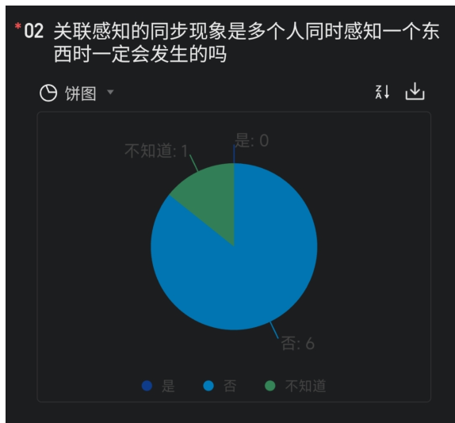

## 四、第四天作业解析

统计：7个人只有3个全对。今天的作业是所有天里面最简单的。

### 第一题

\*01 以下哪个最不属于念模的情感属性

<table border="1"><thead><tr><th>选项</th><th>数量</th></tr></thead><tbody><tr><td>锋利</td><td>0</td></tr><tr><td>硬</td><td>0</td></tr><tr><td>巨大</td><td>4</td></tr><tr><td>热</td><td>0</td></tr><tr><td>有弹性</td><td>3</td></tr></tbody></table>

答案：巨大

解析及点评：“锋利”“硬”“热”“有弹性”都属于质感/力感/感官特质，是可以被直接被动感知的物理性情感属性，比如摸到尖刺感、阻力感、灼烧感、回弹感。居然还有三个人错。

### 第二题

\*02 关联感知的同步现象是多个人同时感知一个东西时一定会发生的吗

<table border="1"><thead><tr><th>选项</th><th>数量</th></tr></thead><tbody><tr><td>是</td><td>0</td></tr><tr><td>否</td><td>6</td></tr><tr><td>不知道</td><td>1</td></tr></tbody></table>
